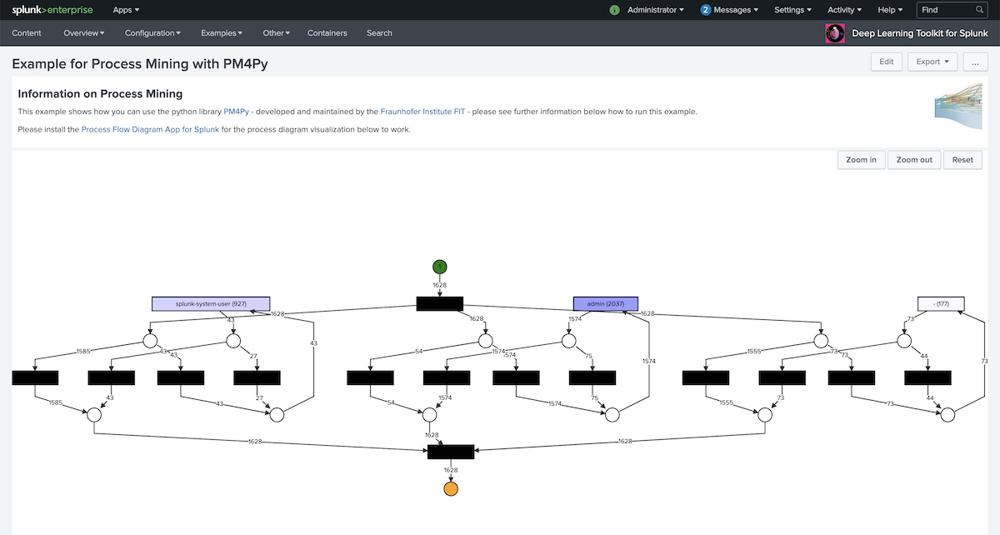

# Deep Learning Toolkit Example for Process Mining with PM4Py
This repository contains an example how [PM4Py](https://pm4py.fit.fraunhofer.de/) can be used with the [Deep Learning Toolkit App for Splunk](https://splunkbase.splunk.com/app/4607/) (DLTK). Please note that [PM4Py is licensed under GPL](https://github.com/pm4py/pm4py-core/blob/release/LICENSE) which states that any derivative work must be published under the same license. Therefore this example is published separately under GPL license. For more information see [PM4Py licensing options](https://pm4py.fit.fraunhofer.de/solution-licensing).

## Installation

In order to run the example provided in this repo please follow these steps:

### Option 1: Quick pip install PM4Py into a running container
For quick testing you can pip install PM4Py into your running DLTK Container with the following steps:
1. Get the container ID with `docker ps`
2. Access the container with `docker exec -it -u 0 <your_container_id> /bin/bash`
3. Install PM4Py with `pip install pm4py`
4. Install graphviz with `apt-get update --fix-missing && apt-get -y install graphviz`

### Option 2: Build pip install into your own DLTK container
For persistent usage in your container you can build PM4Py and its dependencies directly into your own DLTK container.
1. Git clone your DLTK compatible container:
- DLTK 3.x compatible: git clone from [MLTK Container](https://github.com/splunk/splunk-mltk-container-docker) 
- DLTK 4.x compatible: git clone from [DLTK 4.x](https://github.com/splunk/deep-learning-toolkit)
2. Add `RUN apt-get update --fix-missing && apt-get -y install graphviz` to install graphviz
3. Add `RUN pip install pm4py`
4. Build your container with existing build scripts or manually.

## Running the example

In this repository you essentially find 2 files that make up the combined example of a Splunk dashboard and a DLTK Jupyter notebook that runs PM4Py.

### Example dashboard

The dashboard examples is contained in the file [example_process_mining.xml](example_process_mining.xml) in this repository. You can either copy paste its content into a new dashboard that you create from the UI in Splunk OR you copy the file into the DLTK app into `$SPLUNK_HOME/etc/apps/mltk-container/local/example_process_mining.xml` or another app local or default context where you want to have the dashboard.

### Notebook example

The Jupyter notebook that contains the example code how to run PM4Py with DLTK is contained in the file [process_mining.ipynb](process_mining.ipynb). You can import it into Jupyter Lab running in the MLTK/DLTK container and make yourself familiar with the steps taken to run, e.g. an inductive miner or dfg discovery and return petrinets or dfg graphs into the Splunk dashboard either as a static image or as an interactive visualization.

### Visualization

The example dashboard uses the [Process Flow Diagram App](https://github.com/splunk/process_flow_diagram_app) to interactively visualize the results of PM4Py formatted as graphviz dot notation. The visualization component can also run in other modes, please find more information in its [documentation](https://github.com/splunk/process_flow_diagram_app/blob/master/README.md).

## Conclusion

This repository contains all necessary steps and artifacts that you need to run a complete end to end process mining example with Splunk, DLTK and PM4Py.

